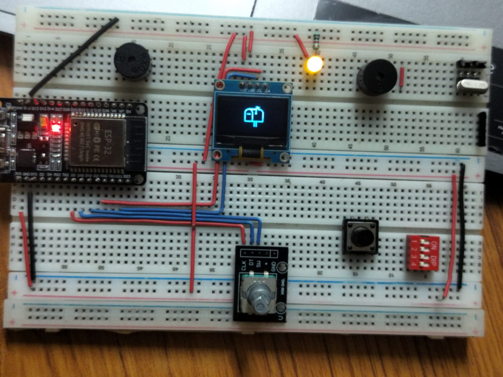
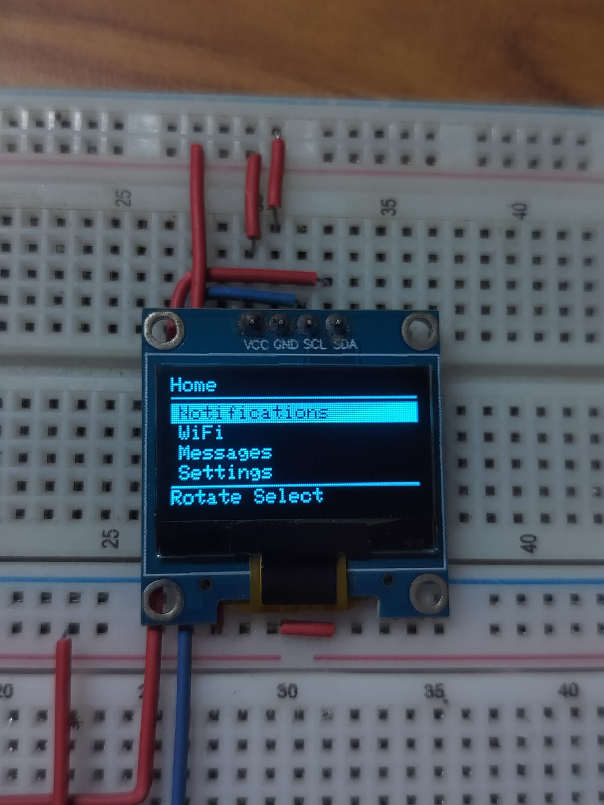

# 📬 Letter-Box

> A smart connected messaging box built around the ESP32, OLED display, rotary encoder, Wi-Fi, and Firebase.

Letter-Box is an embedded IoT messaging device designed to receive and display messages through a compact hardware interface.

The project combines **ESP32**, **OLED display**, **rotary encoder input**, **Wi-Fi connectivity**, and **Firebase Realtime Database** to create a physical messaging interface.

The goal is to build a modular, reliable, and user-friendly embedded system that can receive messages from the cloud and allow the user to navigate and read them directly on the device.

---

## Features

### Currently Implemented

*  OLED-based graphical user interface
*  Rotary encoder navigation
*  Encoder button input
*  Scrollable menus
*  Message list
*  Message viewer
*  Long-message text wrapping
*  Wi-Fi network scanning
*  Wi-Fi connection
*  Wi-Fi password input interface
*  On-device keyboard interface
*  New-message notification thorugh animation
*  Message read/unread status
*  Display animations
*  Modular software architecture
*  Firebase integration
*  Git/GitHub based version control

### Planned Features

*  Message deletion
*  Sending messages from the device
*  Idle/sleep animation
*  Power optimization
*  Improved Firebase event handling
*  Further UI improvements

---

#  Hardware

| Component           | Purpose                  |
| ------------------- | ------------------------ |
| ESP32               | Main microcontroller     |
| OLED Display        | User interface           |
| Rotary Encoder      | Navigation and selection |
| Encoder Push Button | Select/open menu         |
| USB                 | Programming and power    |

### Main Controller

**ESP32**

The ESP32 handles:

* User input
* Display control
* Wi-Fi connectivity
* Firebase communication
* Message management
* UI state management

---

#  Software & Technologies

* **C++**
* **Arduino / PlatformIO**
* **ESP32**
* **Firebase Realtime Database**
* **Wi-Fi**
* **OLED / SSD1306**
* **Adafruit GFX**
* **Git**
* **GitHub**
* **VS Code**

---

# 🔄 How Letter-Box Works

When a new message becomes available:

1. ESP32 connects to Wi-Fi.
2. FirebaseManager communicates with Firebase.
3. Message data is received.
4. MessageManager processes and stores the message.
5. UIManager determines what should be displayed.
6. DisplayManager renders the required screen.
7. The user can navigate through messages using the rotary encoder.

---

#  Wi-Fi System

Letter-Box contains a dedicated `WiFiManager` responsible for network connectivity.

The Wi-Fi interface supports:

* Scanning available networks
* Displaying SSIDs
* Selecting a network
* Entering a password
* Connecting to the selected network
* Displaying connection status

The Wi-Fi functionality is separated from the UI so that network logic and display logic remain independent.

---

#  Firebase

Firebase is used as the cloud backend for Letter-Box.

The Firebase layer is isolated inside the `FirebaseManager`.

### Important

Firebase credentials and private configuration files should **not** be committed to GitHub.

For example:

```text
include/firebase_config.h
```

should remain ignored if it contains private credentials.

Create your own configuration file locally and provide the required credentials according to your Firebase setup.

---

#  User Interface

The UI is controlled using a rotary encoder.

Typical navigation:

```text
Home
 │
 ├── Messages
 │     ├── Message 1
 │     ├── Message 2
 │     └── Message 3
 │
 ├── Wi-Fi
 │     ├── Scan Networks
 │     ├── Select Network
 │     └── Enter Password
 │
 └── Settings
```

The UI is state-based, allowing each screen to handle its own input and display requirements.

---

#  Getting Started

## 1. Clone the repository

```bash
git clone <repository-url>
cd Letter-Box
```

## 2. Open the project

Open the project using **VS Code + PlatformIO**.

## 3. Connect ESP32

Connect the ESP32 development board through USB.

## 4. Configure Firebase

Create the required Firebase configuration locally.

Do not upload private Firebase credentials to GitHub.

## 5. Build the project

```bash
pio run
```

## 6. Upload to ESP32

```bash
pio run --target upload
```

---

#  Configuration

Hardware pins and project configuration should be maintained in the configuration files rather than being scattered throughout the source code.

For example:

```cpp
#define OLED_WIDTH 128
#define OLED_HEIGHT 64
```

and hardware-specific pins can be defined centrally.

This makes it easier to modify the hardware without changing the application logic.

---

#  Development Status

Letter-Box is currently under active development.

### Completed

* [x] Basic ESP32 application
* [x] OLED display integration
* [x] Display manager
* [x] Input manager
* [x] Rotary encoder navigation
* [x] UI manager
* [x] Wi-Fi manager
* [x] Wi-Fi scanning
* [x] Wi-Fi connection
* [x] Password entry UI
* [x] Keyboard interface
* [x] Message manager
* [x] Firebase integration
* [x] Modular project architecture
* [x] Firebase message synchronization
* [x] New-message detection
* [x] Message notifications
* [x] Animation system

### In Progress

* [ ] Power management
* [ ] Improve laging problem
* [ ] Final UI polishing

---

#  Future Improvements

Possible future improvements include:

* Message deletion
* Message replies
* Better animations
* Boot animation
* Notification animation
* Deep-sleep support
* OTA firmware updates
* Improved error handling
* Better offline support
* Smooth controll without lag

---

# 📸 Project Images

Project images, PCB photographs, enclosure designs, and UI screenshots can be added here.

Example:

```markdown
## 📸 Gallery






```
---

# Contributing

This project is currently being developed as a personal embedded-systems project.

Suggestions, improvements, and ideas are welcome.

---

#  Author

**Ravi**

B.Tech Electronics Engineering

Interested in:

* Embedded Systems
* IoT
* ESP32
* STM32
* Electronics
* PCB Design
* Embedded C/C++
* Robotics

---

⭐ If you find this project interesting, consider starring the repository!
